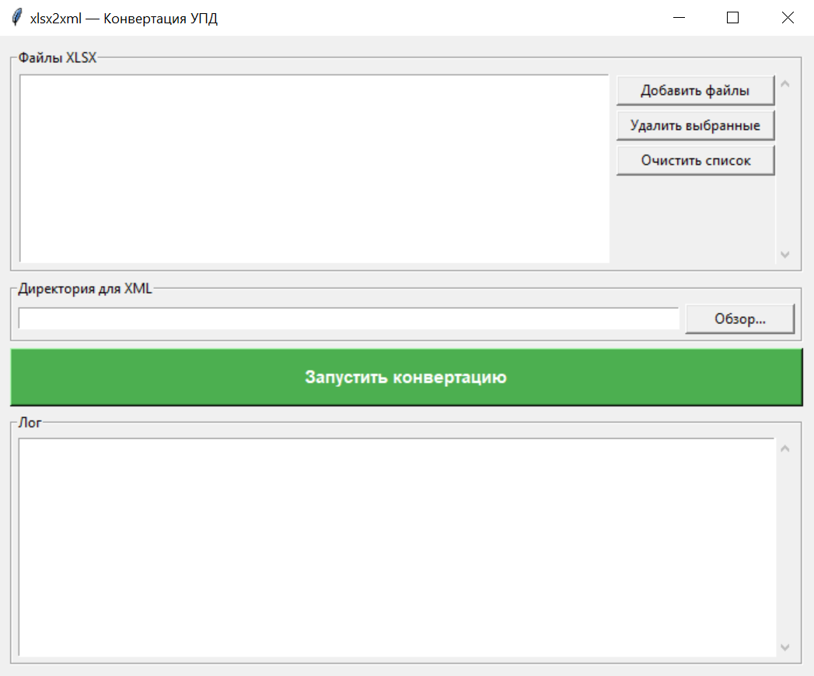

# xlsx2xml
### Конвертация УПД xlsx формы в xml документ
___
## Использование
Скачайте exe-файл со страницы релизов. Версия _cli для работы без окна в консоли.

Запустите exe-файл. Окно программы:



Поля для отображения информации:
 - "Файлы XLSX" отображаются выбранные файлы для конвертации;
 - "Директория для XML" отображается выбранный путь для сохранения получаемых XML файлов;
 - "Лог" информация о текущих операциях и их результатах.

После выбора файлов и директории сохранения, запустите программу кнопкой "Запустить конвертацию".
После выполнения появится информация о результате работы.

## Работа с репозиторием
### Скачать репозиторий
```commandline
git clone https://github.com/Idvon/xlsx2xml.git
```
### Создать окружение
```commandline
virtualenv virtualenv_name
```
### Запустить окружение
```commandline
virtualenv_name\Scripts\activate
```
### Выполнить установку пакетов
```commandline
pip install -r requirements.txt
```
### Запуск
```commandline
python generate_xml.py --xlsx data/exp.xlsx --dir data/   
```
## Сборка
```commandline
virtualenv_name\Scripts\python.exe -m PyInstaller --onefile --windowed --name xlsx2xml gui.py
```
### CLI версия
```commandline
virtualenv_name\Scripts\python.exe -m PyInstaller --onefile --name xlsx2xml_cli generate_xml.py
```